# Table of Contents
1. PRE-SETUP = We are simply getting the environment and data ready
1. TRAIN NEW H2O MODEL = To make use of H2O's libraries, we need to create the models in H2O (ie. our original RF model cannot be directly converted to an h2o model)
1. COMPARE MODEL'S PREDICTIONS = We have the OrigRF and all the other new models generate predictions on the testing data
1. COMPARE MODEL'S METRICS = A true validation of the models' performance, and a correct way of validating if our new models make good proxies for the original model
1. RANDOM FOREST EXPLAINER (or PDPs) = We applied RFE to our origRF model
1. LIME = Here we actually begin to apply LIME to our RF models
1. SHAP Values = We use the H2O library to generate the SHAP values for our H2O RF model
1. PDPs = Similar to the previous section, we use the H2O library to generate the PDPs for the H2O RF model

## Introduction
The goal of this project was to apply interpretability models to the random forest classifier in the PeerJ article ["Prioritizing bona fide bacterial small RNAs with machine learning classifiers"](https://peerj.com/articles/6304/) with the purposes of gaining deeper insights into the prioritization of bona fide bacterial sRNAs. 


## Some key Terms
* OrigRF/Orig RF = Original random forest as found in [link](https://github.com/BioinformaticsLabAtMUN/sRNARanking)
* OrigRF_[scaled/normalized] = refers to any model that was trained in the same manner(same libraries and settings) as in the Original random forest model, but using scaled or normalized data. 
  *  By scaling the data we mean scaling and centering
  *  By normalizing we mean fit the values between 0 and 1
* RFE = Random Forest Explainer
* RF = Random Forest
* IM = Interpretability Model
* "SS" = the free energy of the predicted secondary structure of the sRNA - mostly negative values
* "Pos10wrtsRNAStart" = distance to their closest predicted promoter site
* "DistTerm" = distance to their closest predicted Rho-independent terminator 
* "Distance" = distance to the closest reading frame on the LEFT("upstream") side
* "sameStrand" = boolean, if transcription is going in the same direction as the ORF(Left Open Reading Frame)
  *  ORF = genomic sequence that's supposed to code for a protein
* "DownDistance"  = distance to the closest reading frame on the RIGHT("downstream") side
* "sameDownStrand" =  boolean, if transcription is going in the same direction as the RORF(Right Open Reading Frame)

**Side note:*** When used the word original to refer to the RF model created in the base article, or to refer to models that were created(trained) in the same way as the base random forest model. 

# I) PRE-SETUP
This section is all about getting the libraries and data needed to run this R notebook. We will preprocess the data and load the original model. We start with some **OPTIONAL** memory cleaning (useful if you want to run this from R Studio and with a clean environment)
```{r}
# This section is just about getting the environment ready and cleaned up. Since this project was originally written as a regular R script, and worked from within R Studio, it was just usefull in resetting and cleaning up the the environment, and so this block of code is optional
clc <- function() cat("\014") ; clc()
remove(list = ls())
gc()
```

## 1. Install required libraries 

The following code is based on the h2o documentation site, as it's their recommended way for downloading and installing h2o for R, with only the first if being added as to prevent accidental reinstallations. Here is the [link](http://h2o-release.s3.amazonaws.com/h2o/rel-zahradnik/4/index.html) for those interested in it.  

```{r}

if (! ("h2o" %in% rownames(installed.packages()))) { 
  
    # The following two commands remove any previously installed H2O packages for R.
    if ("package:h2o" %in% search()) { detach("package:h2o", unload=TRUE) }
    if ("h2o" %in% rownames(installed.packages())) { remove.packages("h2o") }
    # Next, we download packages that H2O depends on.
    pkgs <- c("RCurl","jsonlite")
    for (pkg in pkgs) {
      if (! (pkg %in% rownames(installed.packages()))) { install.packages(pkg) }
    }
    # Now we download, install and initialize the H2O package for R.
    install.packages("h2o", type="source", repos="http://h2o-release.s3.amazonaws.com/h2o/rel-zahradnik/4/R")
}  
```

The rest of the libraries can be installed in the same way as with any other library.
```{r}
packages <- c("lime", "ROCR", "PRROC", "randomForest", "randomForestExplainer", "png")
for (package in packages) {
  if (! (package %in% rownames(installed.packages()))) { install.packages(package) }
}

```

## 2. Load the libraries 

```{r}
library("h2o")          # ML model building
library("ROCR")         # ML evaluation
library("PRROC")        # ML evaluation
library("randomForest") # ML model building
library("randomForestExplainer") # ML Global interpretation
library("lime")         # ML local interpretation
library("png")
```

## 3. Load and preprocess the data 

### 3.1 Load the Model's Training Data 
```{r}
trainDataSet <- read.csv("./DataSets/combinedData.csv", header = TRUE)
trainDataSet[,"Class"] <- as.logical(trainDataSet[,"Class"]) # guarantees that our h2o model trains the random forest (RF) as a classification tree and not a regression tree
```

### 3.2 Scale and Center the Training Data 

```{r}
dataSetTrain_scaled <- scale(trainDataSet[,-c(5,7,8,9)], center = TRUE, scale = TRUE)
dataSetTrain_scaled <- cbind( dataSetTrain_scaled[,(1:4)], 
                              trainDataSet[,5],
                              dataSetTrain_scaled[,5],
                              trainDataSet[,c(7,8,9)])
colnames(dataSetTrain_scaled) <- c("SS", "Pos10wrtsRNAStart", "DistTerm", "Distance", 
                                   "sameStrand", "DownDistance", "sameDownStrand", "ID", "Class")
dataSetTrain_scaled[,"Class"] <- as.logical(dataSetTrain_scaled[,"Class"]) # Just making sure Class is taken a logical value
rbind( head(dataSetTrain_scaled,5), tail(dataSetTrain_scaled,5) )

```

### 3.3 Normalize the Training Data
```{r}
normalize <- function(x) {
  return ((x - min(x)) / (max(x) - min(x)))
}

dataSetTrain_norm <- trainDataSet
dataSetTrain_norm$SS <- normalize(dataSetTrain_norm$SS)
dataSetTrain_norm$Pos10wrtsRNAStart <- normalize(dataSetTrain_norm$Pos10wrtsRNAStart)
dataSetTrain_norm$DistTerm <- normalize(dataSetTrain_norm$DistTerm)
dataSetTrain_norm$Distance <- normalize(dataSetTrain_norm$Distance)
dataSetTrain_norm$DownDistance <- normalize(dataSetTrain_norm$DownDistance)
dataSetTrain_norm[,"Class"] <- as.logical(dataSetTrain_norm[,"Class"]) # Just making sure Class is taken a logical value
rbind( head(dataSetTrain_norm,5), tail(dataSetTrain_norm,5) ) 
```

### 3.4 Check for normality in the data
There are certain parameter() in the LIME functions that are recommended based on the distribution of the data. Based on these paremeters, we decided to check for normality in the data

```{r}
dataSetTrainX <- trainDataSet[,-(8:9)]
dataSetTrainY <- trainDataSet[,(8:9)]  

hist(x = as.numeric(dataSetTrainX[,1]), main = "Histogram of SS")
qqnorm(as.numeric(dataSetTrainX[,1]))
qqline(as.numeric(dataSetTrainX[,1]), col = "red", lwd = 2)

hist(x = as.numeric(dataSetTrainX[,2]), main = "Histogram of Pos10wrtsRNAStart")
qqnorm(as.numeric(dataSetTrainX[,2]))
qqline(as.numeric(dataSetTrainX[,2]), col = "red", lwd = 2)

hist(x = as.numeric(dataSetTrainX[,3]), main = "Histogram of DistTerm")
qqnorm(as.numeric(dataSetTrainX[,3]))
qqline(as.numeric(dataSetTrainX[,3]), col = "red", lwd = 2)

hist(x = as.numeric(dataSetTrainX[,4]), main = "Histogram of Distance")
qqnorm(as.numeric(dataSetTrainX[,4]))
qqline(as.numeric(dataSetTrainX[,4]), col = "red", lwd = 2)

hist(x = as.numeric(dataSetTrainX[,5]), main = "Histogram of sameStrand")
qqnorm(as.numeric(dataSetTrainX[,5]))
qqline(as.numeric(dataSetTrainX[,5]), col = "red", lwd = 2)

hist(x = as.numeric(dataSetTrainX[,6]), main = "Histogram of DownDistance")
qqnorm(as.numeric(dataSetTrainX[,6]))
qqline(as.numeric(dataSetTrainX[,6]), col = "red", lwd = 2)

hist(x = as.numeric(dataSetTrainX[,7]), main = "Histogram of sameDownStrand")
qqnorm(as.numeric(dataSetTrainX[,7]))
qqline(as.numeric(dataSetTrainX[,7]), col = "red", lwd = 2)
```

### 3.5 Load testing Datasets
Load Original Testing Data Sets

```{r}
slt2dataPos <- read.csv("./DataSets/SLT2_Positives.tsv", sep = "\t", header = TRUE)
slt2dataPos$Class <- rep(1,nrow(slt2dataPos))
slt2dataNeg <- read.csv("./DataSets/SLT2_Negatives.tsv", sep = "\t", header = TRUE)
slt2dataNeg$Class <- rep(0,nrow(slt2dataNeg))
slt2data <- rbind(slt2dataPos,slt2dataNeg)

ludataPos <- read.csv("./DataSets/Lu_Positives.tsv", sep = "\t", header = TRUE)
ludataPos$Class <- rep(1,nrow(ludataPos))
ludataNeg <- read.csv("./DataSets/Lu_Negatives.tsv", sep = "\t", header = TRUE)
ludataNeg$Class <- rep(0,nrow(ludataNeg))
ludata <- rbind(ludataPos,ludataNeg)
```

### 3.6 Scale testing Datasets
Even though the *scale function* can scale and center the data for us, we need to scale the testing data sets using the training data's standard deviation and means to obtain adequate results.

Scaling Function:
* Xi    = An instance 
* Xmean = Mean/Average of all samples  
* Xsd   = Standard Deviation of our data set 
* Zi    = Scaled Value of Xi
* Zi    = (Xi - Xmean) / Xsd 

```{r}
# Standard Deviation and Mean for Standarization
scale_td <- function( Xi, Xmean, Xsd) {
  return ( (Xi - Xmean) / Xsd ) # Zi
}
trainData_sd_SS        <- sd(trainDataSet[,"SS"])
trainData_sd_Pos       <- sd(trainDataSet[,"Pos10wrtsRNAStart"])
trainData_sd_DisTerm   <- sd(trainDataSet[,"DistTerm"])
trainData_sd_Dis       <- sd(trainDataSet[,"Distance"])
trainData_sd_DownDis   <- sd(trainDataSet[,"DownDistance"])

trainData_mean_SS      <- mean(trainDataSet[,"SS"])
trainData_mean_Pos     <- mean(trainDataSet[,"Pos10wrtsRNAStart"])
trainData_mean_DisTerm <- mean(trainDataSet[,"DistTerm"])
trainData_mean_Dis     <- mean(trainDataSet[,"Distance"])
trainData_mean_DownDis <- mean(trainDataSet[,"DownDistance"])

slt2data_scaled <- slt2data
slt2data_scaled$SS                <- scale_td(slt2data_scaled$SS, 
                                              trainData_mean_SS, trainData_sd_SS)
slt2data_scaled$Pos10wrtsRNAStart <- scale_td(slt2data_scaled$Pos10wrtsRNAStart,
                                              trainData_mean_Pos, trainData_sd_Pos)
slt2data_scaled$DistTerm          <- scale_td(slt2data_scaled$DistTerm, 
                                              trainData_mean_DisTerm, trainData_sd_DisTerm)
slt2data_scaled$Distance          <- scale_td(slt2data_scaled$Distance,
                                              trainData_mean_Dis, trainData_sd_Dis)
slt2data_scaled$DownDistance      <- scale_td(slt2data_scaled$DownDistance,
                                              trainData_mean_DownDis, trainData_sd_DownDis)
ludata_scaled <- ludata

ludata_scaled$SS                <- scale_td(ludata_scaled$SS, 
                                              trainData_mean_SS, trainData_sd_SS)
ludata_scaled$Pos10wrtsRNAStart <- scale_td(ludata_scaled$Pos10wrtsRNAStart,
                                              trainData_mean_Pos, trainData_sd_Pos)
ludata_scaled$DistTerm          <- scale_td(ludata_scaled$DistTerm, 
                                              trainData_mean_DisTerm, trainData_sd_DisTerm)
ludata_scaled$Distance          <- scale_td(ludata_scaled$Distance,
                                              trainData_mean_Dis, trainData_sd_Dis)
ludata_scaled$DownDistance      <- scale_td(ludata_scaled$DownDistance,
                                              trainData_mean_DownDis, trainData_sd_DownDis)

rbind( head(slt2data_scaled,5), tail(slt2data_scaled,5))
rbind( head(ludata_scaled,5), tail(ludata_scaled,5))

```

### 3.7 Normalize testing Datasets
In a similar fashion to what we did in 3.6, we also need to use the training data's max and min values to properly normalize each feature.

```{r}
normalize_td <- function(x, min, max) {
  return ( (x - min) / (max - min) )
}

trainData_max_SS      <- max(trainDataSet[,"SS"])
trainData_max_Pos     <- max(trainDataSet[,"Pos10wrtsRNAStart"])
trainData_max_DisTerm <- max(trainDataSet[,"DistTerm"])
trainData_max_Dis     <- max(trainDataSet[,"Distance"])
trainData_max_DownDis <- max(trainDataSet[,"DownDistance"])

trainData_min_SS      <- min(trainDataSet[,"SS"])
trainData_min_Pos     <- min(trainDataSet[,"Pos10wrtsRNAStart"])
trainData_min_DisTerm <- min(trainDataSet[,"DistTerm"])
trainData_min_Dis     <- min(trainDataSet[,"Distance"])
trainData_min_DownDis <- min(trainDataSet[,"DownDistance"])

slt2data_norm <- slt2data
slt2data_norm$SS                <- normalize_td(slt2data_norm$SS, 
                                                 trainData_min_SS, trainData_max_SS)
slt2data_norm$Pos10wrtsRNAStart <- normalize_td(slt2data_norm$Pos10wrtsRNAStart,
                                                 trainData_min_Pos, trainData_max_Pos)
slt2data_norm$DistTerm          <- normalize_td(slt2data_norm$DistTerm,
                                        trainData_min_DisTerm, trainData_max_DisTerm)
slt2data_norm$Distance          <- normalize_td(slt2data_norm$Distance,
                                        trainData_min_Dis, trainData_max_Dis)
slt2data_norm$DownDistance      <- normalize_td(slt2data_norm$DownDistance,
                                            trainData_min_DownDis, trainData_max_DownDis)
ludata_norm <- ludata
ludata_norm$SS                <- normalize_td(ludata_norm$SS, 
                                                 trainData_min_SS, trainData_max_SS)
ludata_norm$Pos10wrtsRNAStart <- normalize_td(ludata_norm$Pos10wrtsRNAStart,
                                                 trainData_min_Pos, trainData_max_Pos)
ludata_norm$DistTerm          <- normalize_td(ludata_norm$DistTerm,
                                                 trainData_min_DisTerm, trainData_max_DisTerm)
ludata_norm$Distance          <- normalize_td(ludata_norm$Distance,
                                                 trainData_min_Dis, trainData_max_Dis)
ludata_norm$DownDistance      <- normalize_td(ludata_norm$DownDistance,
                                                 trainData_min_DownDis, trainData_max_DownDis)

rbind( head(slt2data_norm,5), tail(slt2data_norm,5))

rbind( head(ludata_norm,5), tail(ludata_norm,5))

```

## 4. Load original model

The original article, titled "Prioritizing bona fide bacterial small RNAs with machine learning classifiers", and the source materials(training data, testing data, R scripts, .rds file, etc.) can all be found in [PeerJ](https://peerj.com/articles/6304/) under the following [link](https://peerj.com/articles/6304/).
The original *.rds* file can also be downloaded from [github](https://github.com/BioinformaticsLabAtMUN/sRNARanking).

### 4.1 Load/Retrain Orig Model
We can either retrain the original model, or load the .rds file provided in the original article. For the purpose of saving time, we simply loaded the model.

```{r}
origRF <- readRDS("RF_classifier4sRNA.rds")
```

### 4.2 Retrain new models with Scaled and Normalized Data 
Since some of the IM models required scaling or normalized data to properly function, we needed to create 2 new models in the same way as the one loaded in 4.1. 

```{r}
tuneRF(dataSetTrainX[,c(1:7)], y = factor(dataSetTrainY[,2]), ntreeTry = 400, mtryStart = 2)
set.seed(1234)
origRF_scaled <- randomForest(x = dataSetTrain_scaled[,c(1:7)], y = factor(dataSetTrainY[,2]), mtry = 2, ntree = 400, importance = TRUE)
origRF_norm <- randomForest(x = dataSetTrain_norm[,c(1:7)], y = factor(dataSetTrainY[,2]), mtry = 2, ntree = 400, importance = TRUE)
```

# II) TRAIN THE NEW H2O MODEL 
Since we are going to use the h2o library to perform some of our machine learning interpretability, we need to train an equivalent one, using the h2o tools.

## 5. Intialize H2O and load training data 

```{r}
h2o.init(              # Initialize h2o
  nthreads = -1,       # -1 = use all available threads
  max_mem_size = "8G"  # specify the amount of memory to use
)
h2o.removeAll()        # clean up the system, h2o-wise (ie. kill any running h2o clusters)
h2o.no_progress() 
trainData <- as.h2o(trainDataSet) 
trainData_scaled <- as.h2o(dataSetTrain_scaled) 
trainData_norm <- as.h2o(dataSetTrain_norm) 
```

## 6. Build model
### 6.1 Build model with Orig Training data
```{r}
rfh2o <- h2o.randomForest( 
             training_frame = trainData, # training using the normal data
             x = 1:7,                    # features to use to generate the prediction
             y = 9,                      # Class type -> what we want to predict
             model_id = "rf1_sRNA",      # name of model in h2o
             ntrees = 400,               # max number of trees  
             seed = 1234,                # seed, has to be set WITHIN the h2o function and it's supposed to be different from "R's seed", so results might not be exactly the same as orig model, but should be similar enough
             mtries = 2,                 # Same as original model 
             max_depth = 30
)
```

### 6.2 Build model with Scaled Training data 
```{r}
rfh2o_scaled <- h2o.randomForest( 
  training_frame = trainData_scaled,
  x = 1:7,                
  y = 9,                     
  model_id = "rf2_sRNA",     
  ntrees = 400,              
  seed = 1234,              
  mtries = 2,                
  max_depth = 30
)
```

### 6.3 Build model with Norm Training data
```{r}
rfh2o_norm <- h2o.randomForest( 
  training_frame = trainData_norm, 
  x = 1:7,                  
  y = 9,                    
  model_id = "rf3_sRNA",     
  ntrees = 400,               
  seed = 1234,               
  mtries = 2,                  
  max_depth = 30
)
```

### 6.4 BONUS: Build GLM model
As we were doing tests with LIME, we discovered that it yielded irregular responses, and as a result, the explanations could not be trusted at the time. It seems to be a known issue that LIME is not perfect for every model, and that it struggles with data that is highly diverse. In this use case, our data contains mixed numerical and categorical features, significantly different scales and magnitudes in our numercial features, and an inbalanced data sets that favors predictions of sRNAs being false. Since lime creates a local interpretable linear model for its explanations, the GLM constructed here was simply to verify the hypothesis that a linear model would be unable to explain the data. The "unbalanced-ness" seems to create models where the features tend always support a result of "false", while claiming that all the features are against a result of true, which will be evicenced in section 15.1.

```{r}
glmh2o <- h2o.glm( # https://docs.h2o.ai/h2o/latest-stable/h2o-docs/data-science/glm.html 
  training_frame = trainData, # training using the normal data
  x = 1:7,                   # features to use to generate the prediction
  y = 9,                     # Class type -> what we want to predict
  model_id = "glm_sRNA",     # name of model in h2o
  seed = 1234,
  family = "binomial"
)

glmh2o_perf <- h2o.performance(glmh2o)
glmh2o_perf
h2o.coef(glmh2o)
h2o.coef_norm(glmh2o)
glmh2o@model$coefficients_table

h2o.r2(glmh2o) # R^2 value is really low, and having a Max Recall being really low, meaning that LIME is also predicting that everything should be false
```

## 7. Preview H2O's RF 
This is the performance with the OOB error, based on the training process (ie training data)

```{r}
rfh2o
rfh2o@model$variable_importances
h2o.varimp_plot(rfh2o)
rfh2o_training_peformance <- h2o.performance(rfh2o)
rfh2o_training_peformance
```


# III) COMPARE MODEL'S PREDICTIONS
In this section we'll get the predictions all the models generate on the testing data LU and SLT2. The goal of this section is not to prove which model is the best, but to prove that the models are similar enough to the point that the analysis of the H2O model will be a valid analogy model for the original RF model. 

## 8. Get Testing Data Predictions from the Models
```{r}
origRF_lu_pred <- predict(origRF, ludata[,-8], type = "prob")
origRF_slt2_pred <- predict(origRF, slt2data[,-8], type = "prob")

origRF_scaled_lu_pred <- predict(origRF_scaled, ludata_scaled[,-8], type = "prob")
origRF_scaled_slt2_pred <- predict(origRF_scaled, slt2data_scaled[,-8], type = "prob")

origRF_norm_lu_pred <- predict(origRF_norm, ludata_norm[,-8], type = "prob")
origRF_norm_slt2_pred <- predict(origRF_norm, slt2data_norm[,-8], type = "prob")

rfh2o_slt2_pred <- h2o.predict(object = rfh2o, newdata = as.h2o(slt2data[,-8]) )
rfh2o_lu_pred <- h2o.predict(object = rfh2o, newdata = as.h2o(ludata[,-8]) )

rfh2o_scaled_slt2_pred <- h2o.predict(object = rfh2o_scaled, newdata = as.h2o(slt2data_scaled[,-8]) )
rfh2o_scaled_lu_pred <- h2o.predict(object = rfh2o_scaled, newdata = as.h2o(ludata_scaled[,-8]) )

rfh2o_norm_slt2_pred <- h2o.predict(object = rfh2o_norm, newdata = as.h2o(slt2data_norm[,-8]) )
rfh2o_norm_lu_pred <- h2o.predict(object = rfh2o_norm, newdata = as.h2o(ludata_norm[,-8]) )

glm_slt2_pred <- h2o.predict(object = glmh2o, newdata = as.h2o(slt2data[,-8]) )
glm_lu_pred <- h2o.predict(object = glmh2o, newdata = as.h2o(ludata[,-8]) )
```

## 9. Create a comparison function 
This function is to simplify the comparison between the predictions from the Original RF model and the H2O RF model. Later on this, this function will be used to compare the predictions between the OrigRF model and the other models. 

```{r}
# This function will be used later on, and 
#   a = the original model's predictions
#   b = the alternate model's predictions
#   c = the correct prediction

compareAnswers <- function(a,b,c){
  if ( a == c & b == c ) 
      { res="BOTH_RIGHT" }
  else if ( a == c & b != c ) 
      { res="OnlyA"  }
  else if ( a != c & b == c ) 
      { res="OnlyB"  }
  else 
      { res="BOTH_WRONG"  }
  return(res)
}
```

## 10. SLT2 comparisons 
### 10.1 Build SLT2 Predictions table 

```{r}
slt2_predictions <-  cbind(as.data.frame(slt2data),               # Input
                           as.data.frame(origRF_slt2_pred[,2]),   # Orig RF predictions 
                           as.data.frame(origRF_scaled_slt2_pred[,2]),   # Orig RF Scaled predictions 
                           as.data.frame(origRF_norm_slt2_pred[,2]),   # Orig RF Normalized predictions   
                           as.data.frame(rfh2o_slt2_pred[,3]),        # H2O RF predictions
                           as.data.frame(rfh2o_scaled_slt2_pred[,3]), # Scaled RF predictions
                           as.data.frame(rfh2o_norm_slt2_pred[,3])    # Normalized RF predictions
                           )

colnames(slt2_predictions) <- c("SS", "Pos10wrtsRNAStart", "DistTerm", "Distance", 
                                "sameStrand", "DownDistance", "sameDownStrand", "Class",
                                "OrigRF_P","OrigRF_scaled_P","OrigRF_norm_P",
                                "RF_H2O_P","RFH2O_scaled_P","RFH2O_norm_P")

slt2_predictions$origPreds <- ifelse( slt2_predictions$OrigRF_P >= 0.5, 1, 0) 
slt2_predictions$origScaledPreds <- ifelse( slt2_predictions$OrigRF_scaled_P >= 0.5, 1, 0) 
slt2_predictions$origNormPreds <- ifelse( slt2_predictions$OrigRF_norm_P >= 0.5, 1, 0) 
slt2_predictions$h2oPreds  <- ifelse( slt2_predictions$RF_H2O_P >= 0.5, 1, 0) 
slt2_predictions$h2oScaledPreds  <- ifelse( slt2_predictions$RFH2O_scaled_P >= 0.5, 1, 0) 
slt2_predictions$h2oNormPreds  <- ifelse( slt2_predictions$RFH2O_norm_P >= 0.5, 1, 0)  

slt2_predictions$origVsH2O <- NA
slt2_predictions$origVsOrigScaled <- NA
slt2_predictions$origVsOrigNorm <- NA
slt2_predictions$origVsH2OScaled <- NA
slt2_predictions$origVsH2ONorm <- NA

for( i in 1:nrow(slt2_predictions) ){
  # Based on the way we are feeding the values to the compareAnswers function, 
  # Similiarities = OnlyA means that only the Orig RF got the right answer
  # Similiarities = OnlyB means that only the other RF got the right answer
  # All other answers will tell us where both models were right("BOTH_RIGHT"), or
  # wrong ("BOTH_WRONG")
  slt2_predictions[i,]$origVsOrigScaled <- compareAnswers(
    slt2_predictions[i,]$origPreds, slt2_predictions[i,]$origScaledPreds,slt2_predictions[i,]$Class )
  slt2_predictions[i,]$origVsOrigNorm <- compareAnswers(
    slt2_predictions[i,]$origPreds, slt2_predictions[i,]$origNormPreds, slt2_predictions[i,]$Class )
  slt2_predictions[i,]$origVsH2O <- compareAnswers(
    slt2_predictions[i,]$origPreds, slt2_predictions[i,]$h2oPreds, slt2_predictions[i,]$Class )
  slt2_predictions[i,]$origVsH2OScaled <- compareAnswers(
    slt2_predictions[i,]$origPreds, slt2_predictions[i,]$h2oScaledPreds, slt2_predictions[i,]$Class )
  slt2_predictions[i,]$origVsH2ONorm <- compareAnswers(
    slt2_predictions[i,]$origPreds, slt2_predictions[i,]$h2oNormPreds, slt2_predictions[i,]$Class )
} 

rbind( head(slt2_predictions, 5), tail(slt2_predictions, 5) )

str(slt2_predictions)

```

As an additional check, we also reviewed the correlations between the OrigRF predictions, and the alternative models's predictions with the SLT2 predictions. 

```{r}
cor(slt2_predictions[,"OrigRF_P"],slt2_predictions[,"RF_H2O_P"]) 
cor(slt2_predictions[,"OrigRF_P"],slt2_predictions[,"OrigRF_scaled_P"])
cor(slt2_predictions[,"OrigRF_P"],slt2_predictions[,"OrigRF_norm_P"])
cor(slt2_predictions[,"OrigRF_P"],slt2_predictions[,"RFH2O_scaled_P"]) 
cor(slt2_predictions[,"OrigRF_P"],slt2_predictions[,"RFH2O_norm_P"])
```

### 10.2 Compare OrigRF vs the other Models with the SLT2 data
Here, we are simply taking a look at how many instances the OrigRF model got correct vs the other models, and how many instances both models predicted correctly or wrong.
  * A value of *OnlyA* means that only the orig RF got the right answer
  * A value of *OnlyB* means that only the other RF got the right answer
  * All other answers will tell us where both models were right *("BOTH_RIGHT")* or wrong *("BOTH_WRONG")*

#### 10.2.2 Compare OrigRF vs OrigRF Scaled Model 
```{r}
nrow( slt2_predictions[slt2_predictions$origVsOrigScaled == "OnlyA",] )
nrow( slt2_predictions[slt2_predictions$origVsOrigScaled == "OnlyB",] )
nrow( slt2_predictions[slt2_predictions$origVsOrigScaled == "BOTH_WRONG",] )
nrow( slt2_predictions[slt2_predictions$origVsOrigScaled == "BOTH_RIGHT",] )
```

#### 10.2.3 Compare OrigRF vs OrigRF Norm Model 
```{r}
nrow( slt2_predictions[slt2_predictions$origVsOrigNorm == "OnlyA",] )
nrow( slt2_predictions[slt2_predictions$origVsOrigNorm == "OnlyB",] )
nrow( slt2_predictions[slt2_predictions$origVsOrigNorm == "BOTH_WRONG",] )
nrow( slt2_predictions[slt2_predictions$origVsOrigNorm == "BOTH_RIGHT",] )
```

#### 10.2.4 Compare OrigRF vs H2O Model 
```{r}
nrow( slt2_predictions[slt2_predictions$origVsH2O == "OnlyA",] )
nrow( slt2_predictions[slt2_predictions$origVsH2O == "OnlyB",] )
nrow( slt2_predictions[slt2_predictions$origVsH2O == "BOTH_WRONG",] )
nrow( slt2_predictions[slt2_predictions$origVsH2O == "BOTH_RIGHT",] )
```

#### 10.2.5 Compare OrigRF vs H2O Model Scaled 

```{r}
nrow( slt2_predictions[slt2_predictions$origVsH2OScaled == "OnlyA",] )
nrow( slt2_predictions[slt2_predictions$origVsH2OScaled == "OnlyB",] )
nrow( slt2_predictions[slt2_predictions$origVsH2OScaled == "BOTH_WRONG",] )
nrow( slt2_predictions[slt2_predictions$origVsH2OScaled == "BOTH_RIGHT",] )
```

#### 10.2.6 Compare OrigRF vs H2O Model Normalized 
```{r}
nrow( slt2_predictions[slt2_predictions$origVsH2ONorm == "OnlyA",] )
nrow( slt2_predictions[slt2_predictions$origVsH2ONorm == "OnlyB",] )
nrow( slt2_predictions[slt2_predictions$origVsH2ONorm == "BOTH_WRONG",] )
nrow( slt2_predictions[slt2_predictions$origVsH2ONorm == "BOTH_RIGHT",] )
```

## 11. LU Comparisons 
### 11.1 Build LU Predictions table 

```{r}
lu_predictions <-  cbind(as.data.frame(ludata),               # Input
                           as.data.frame(origRF_lu_pred[,2]),   # Orig RF predictions 
                           as.data.frame(origRF_scaled_lu_pred[,2]),   # Orig RF Scaled predictions 
                           as.data.frame(origRF_norm_lu_pred[,2]),   # Orig RF Normalized predictions   
                           as.data.frame(rfh2o_lu_pred[,3]),        # H2O RF predictions
                           as.data.frame(rfh2o_scaled_lu_pred[,3]), # Scaled RF predictions
                           as.data.frame(rfh2o_norm_lu_pred[,3])    # Normalized RF predictions
)

colnames(lu_predictions) <- c("SS", "Pos10wrtsRNAStart", "DistTerm", "Distance", 
                                "sameStrand", "DownDistance", "sameDownStrand", "Class",
                                "OrigRF_P","OrigRF_scaled_P","OrigRF_norm_P",
                                "RF_H2O_P","RFH2O_scaled_P","RFH2O_norm_P")
                                
lu_predictions$origPreds <- ifelse( lu_predictions$OrigRF_P >= 0.5, 1, 0) 
lu_predictions$origScaledPreds <- ifelse( lu_predictions$OrigRF_scaled_P >= 0.5, 1, 0) 
lu_predictions$origNormPreds <- ifelse( lu_predictions$OrigRF_norm_P >= 0.5, 1, 0) 
lu_predictions$h2oPreds  <- ifelse( lu_predictions$RF_H2O_P >= 0.5, 1, 0) 
lu_predictions$h2oScaledPreds  <- ifelse( lu_predictions$RFH2O_scaled_P >= 0.5, 1, 0) 
lu_predictions$h2oNormPreds  <- ifelse( lu_predictions$RFH2O_norm_P >= 0.5, 1, 0)  

lu_predictions$origVsH2O <- NA
lu_predictions$origVsOrigScaled <- NA
lu_predictions$origVsOrigNorm <- NA
lu_predictions$origVsH2OScaled <- NA
lu_predictions$origVsH2ONorm <- NA

for( i in 1:nrow(lu_predictions) ){
  # Based on the way we are feeding the values to the compareAnswers function, 
  # Similiarities = OnlyA means that only the Orig RF got the right answer
  # Similiarities = OnlyB means that only the other RF got the right answer
  # All other answers will tell us where both models were right("BOTH_RIGHT"), or
  # wrong ("BOTH_WRONG")
  lu_predictions[i,]$origVsOrigScaled <- compareAnswers(
    lu_predictions[i,]$origPreds, lu_predictions[i,]$origScaledPreds,lu_predictions[i,]$Class )
  lu_predictions[i,]$origVsOrigNorm <- compareAnswers(
    lu_predictions[i,]$origPreds, lu_predictions[i,]$origNormPreds,  lu_predictions[i,]$Class )
  lu_predictions[i,]$origVsH2O <- compareAnswers(
    lu_predictions[i,]$origPreds, lu_predictions[i,]$h2oPreds,       lu_predictions[i,]$Class )
  lu_predictions[i,]$origVsH2OScaled <- compareAnswers(
    lu_predictions[i,]$origPreds, lu_predictions[i,]$h2oScaledPreds, lu_predictions[i,]$Class )
  lu_predictions[i,]$origVsH2ONorm <- compareAnswers(
    lu_predictions[i,]$origPreds, lu_predictions[i,]$h2oNormPreds,   lu_predictions[i,]$Class )
} 

str(lu_predictions)

rbind( head(lu_predictions, 5), tail(lu_predictions, 5))

```

As an additional check, we also review the correlations between the OrigRF predictions, and the alternative models' predictions with the LU data.

```{r}
cor(lu_predictions[,"OrigRF_P"],lu_predictions[,"RF_H2O_P"]) 
cor(lu_predictions[,"OrigRF_P"],lu_predictions[,"OrigRF_scaled_P"])
cor(lu_predictions[,"OrigRF_P"],lu_predictions[,"OrigRF_norm_P"])
cor(lu_predictions[,"OrigRF_P"],lu_predictions[,"RFH2O_scaled_P"]) 
cor(lu_predictions[,"OrigRF_P"],lu_predictions[,"RFH2O_norm_P"])
```


### 11.2 Compare OrigRF vs the other Models with the LU data
Basically, the same explanation as in section 10.2
  * A value of *OnlyA* means that only the orig RF got the right answer
  * A value of *OnlyB* means that only the other RF got the right answer
  * All other answers will tell us where both models were right *("BOTH_RIGHT")* or wrong *("BOTH_WRONG")*

#### 11.2.1 Compare OrigRF vs OrigRF Scaled Model 
```{r}
nrow( lu_predictions[lu_predictions$origVsOrigScaled == "OnlyA",] )
nrow( lu_predictions[lu_predictions$origVsOrigScaled == "OnlyB",] )
nrow( lu_predictions[lu_predictions$origVsOrigScaled == "BOTH_WRONG",] )
nrow( lu_predictions[lu_predictions$origVsOrigScaled == "BOTH_RIGHT",] )
```

#### 11.2.2 Compare OrigRF vs OrigRF Norm Model 
```{r}
nrow( lu_predictions[lu_predictions$origVsOrigNorm == "OnlyA",] )
nrow( lu_predictions[lu_predictions$origVsOrigNorm == "OnlyB",] )
nrow( lu_predictions[lu_predictions$origVsOrigNorm == "BOTH_WRONG",] )
nrow( lu_predictions[lu_predictions$origVsOrigNorm == "BOTH_RIGHT",] )
```

#### 11.2.3 Compare OrigRF vs H2O Model 
```{r}
nrow( lu_predictions[lu_predictions$origVsH2O == "OnlyA",] )
nrow( lu_predictions[lu_predictions$origVsH2O == "OnlyB",] )
nrow( lu_predictions[lu_predictions$origVsH2O == "BOTH_WRONG",] )
nrow( lu_predictions[lu_predictions$origVsH2O == "BOTH_RIGHT",] )
```

#### 11.2.4 Compare OrigRF vs H2O Model Scaled 
```{r}
nrow( lu_predictions[lu_predictions$origVsH2OScaled == "OnlyA",] )
nrow( lu_predictions[lu_predictions$origVsH2OScaled == "OnlyB",] )
nrow( lu_predictions[lu_predictions$origVsH2OScaled == "BOTH_WRONG",] )
nrow( lu_predictions[lu_predictions$origVsH2OScaled == "BOTH_RIGHT",] )
```

#### 11.2.5 Compare OrigRF vs H2O Model Normalized 
```{r}
nrow( lu_predictions[lu_predictions$origVsH2ONorm == "OnlyA",] )
nrow( lu_predictions[lu_predictions$origVsH2ONorm == "OnlyB",] )
nrow( lu_predictions[lu_predictions$origVsH2ONorm == "BOTH_WRONG",] )
nrow( lu_predictions[lu_predictions$origVsH2ONorm == "BOTH_RIGHT",] )
```

# IV) COMPARE MODEL'S METRICS 

While sections 11.2 and 10.2 suggest that all the models are behaving similarly, making a judgement solely on accuracy can be deceiving. For this reason, we also decided to dive deeper into the model's performances, and do additional side by side comparison of other performance metrics. 

## 12. Get Performance Metrics 
This *evaluateData* function was copied directly from the source materials(the [additional material](https://peerj.com/articles/6304/) included in the original article), as it was the one used to evaluate the original model, and we've simply added comments a few extra comments. The H2O library already contains tools to obtain performance metrics from its models, so no additional functions were necessary with the H2O ML models.  

```{r}
evaluateData <- function(RF, data, labels){
  require(ROCR)
  require(PRROC)
  require(randomForest)
  res <- list()
  res$predD <- predict(RF, data, type = "prob")                        # Predictions as Generated by the model
  res$pred <- prediction(res$predD[,2], as.logical(labels))            # Predictions, but converted to S4 Object          
  res$PR <- performance(res$pred, measure = "prec", x.measure = "rec") # Precision Recall Curve
  res$SS <- performance(res$pred, measure="sens", x.measure="spec")    # Sensitivity vs. Specificity
  res$auc  <- performance(res$pred, measure = "auc")                   # Sensitivity vs. Specificity AUC
  res$acc <-  performance(res$pred, measure = "acc")                   # Accuracy
  res$pr <- pr.curve(scores.class0 = res$predD[labels == 1,2],         # Precision vs. Recall 
                     scores.class1 = res$predD[labels == 0,2], 
                     curve = T)
  return(res)
}

# OrigRF Performance Metrics
origRF_slt2_performance <- evaluateData(origRF, slt2data[,-8], slt2data[,8])
origRF_scaled_slt2_performance <- evaluateData(origRF_scaled, slt2data_scaled[,-8], slt2data_scaled[,8])
origRF_norm_slt2_performance <- evaluateData(origRF_norm, slt2data_norm[,-8], slt2data_norm[,8])

origRF_lu_performance <- evaluateData(origRF, ludata[,-8], ludata[,8])
origRF_scaled_lu_performance <- evaluateData(origRF_scaled, ludata_scaled[,-8], ludata_scaled[,8])
origRF_norm_lu_performance <- evaluateData(origRF_norm, ludata_norm[,-8], ludata_norm[,8])


# H2O RF Performance Metrics
# H2O provides a way to retrieve most of the desired metrics
# http://docs.h2o.ai/h2o/latest-stable/h2o-r/docs/reference/h2o.metric.html

slt2data_h2o <- slt2data
slt2data_h2o[,"Class"] <- as.logical(slt2data_h2o[,"Class"]) 
rfh2o_slt2_performance <- h2o.performance(rfh2o, newdata = as.h2o(slt2data_h2o))

ludata_h2o <- ludata
ludata_h2o[,"Class"] <- as.logical(ludata_h2o[,"Class"]) 
rfh2o_lu_performance <- h2o.performance(rfh2o, newdata = as.h2o(ludata_h2o))

slt2data_h2o_scaled <- slt2data_scaled
slt2data_h2o_scaled[,"Class"] <- as.logical(slt2data_h2o_scaled[,"Class"]) 
rfh2o_slt2_performance_scaled <- h2o.performance(rfh2o, newdata = as.h2o(slt2data_h2o_scaled))

ludata_h2o_scaled <- ludata_scaled
ludata_h2o_scaled[,"Class"] <- as.logical(ludata_h2o_scaled[,"Class"]) 
rfh2o_lu_performance_scaled <- h2o.performance(rfh2o, newdata = as.h2o(ludata_h2o_scaled))

slt2data_h2o_norm <- slt2data_norm
slt2data_h2o_norm[,"Class"] <- as.logical(slt2data_h2o_norm[,"Class"]) 
rfh2o_slt2_performance_norm <- h2o.performance(rfh2o, newdata = as.h2o(slt2data_h2o_norm))

ludata_h2o_norm <- ludata_norm
ludata_h2o_norm[,"Class"] <- as.logical(ludata_h2o_norm[,"Class"]) 
rfh2o_lu_performance_norm <- h2o.performance(rfh2o, newdata = as.h2o(ludata_h2o_norm))
```

## 13. Compare Metrics  
### 13.1 Accuracy
#### 13.1.1 Accuracy Table
```{r}
metrics_table <- data.frame("Accuracy" = 1:12)
rownames(metrics_table) <- c("origRF_slt2_perf", "origRF_scaled_slt2_perf", "origRF_norm_slt2_perf",
                             "rfh2o_slt2_perf", "rfh2o_slt2_perf_scaled", "rfh2o_slt2_perf_norm",
                             "origRF_lu_perf", "origRF_scaled_lu_perf", "origRF_norm_lu_perf", 
                             "rfh2o_lu_perf",  "rfh2o_lu_perf_scaled",  "rfh2o_lu_perf_norm")

metrics_table["origRF_slt2_perf","Accuracy"]        <- nrow(slt2_predictions[slt2_predictions$origVsOrigScaled == "BOTH_RIGHT" | slt2_predictions$origVsOrigScaled == "OnlyA",] )/
  nrow(slt2_predictions)
metrics_table["origRF_scaled_slt2_perf","Accuracy"] <- nrow(slt2_predictions[slt2_predictions$origVsOrigScaled == "BOTH_RIGHT" | slt2_predictions$origVsOrigScaled == "OnlyB",] )/
  nrow(slt2_predictions)
metrics_table["origRF_norm_slt2_perf","Accuracy"]   <- nrow(slt2_predictions[slt2_predictions$origVsOrigNorm == "BOTH_RIGHT" | slt2_predictions$origVsOrigNorm == "OnlyB",] )/
  nrow(slt2_predictions)

metrics_table["rfh2o_slt2_perf","Accuracy"]         <- nrow(slt2_predictions[slt2_predictions$origVsH2O == "BOTH_RIGHT" | slt2_predictions$origVsH2O == "OnlyB",] )/
  nrow(slt2_predictions)
metrics_table["rfh2o_slt2_perf_scaled","Accuracy"]  <- nrow(slt2_predictions[slt2_predictions$origVsH2OScaled == "BOTH_RIGHT" |  slt2_predictions$origVsH2OScaled == "OnlyB",])/
  nrow(slt2_predictions)
metrics_table["rfh2o_slt2_perf_norm","Accuracy"]    <- nrow(slt2_predictions[slt2_predictions$origVsH2ONorm == "BOTH_RIGHT" | slt2_predictions$origVsH2ONorm == "OnlyB",])/
  nrow(slt2_predictions)

metrics_table["origRF_lu_perf","Accuracy"]          <- nrow(lu_predictions[lu_predictions$origVsH2O == "BOTH_RIGHT" | lu_predictions$origVsH2O == "OnlyA",] )/
  nrow(lu_predictions)
metrics_table["origRF_scaled_lu_perf","Accuracy"]   <- nrow(lu_predictions[lu_predictions$origVsOrigScaled == "BOTH_RIGHT" | lu_predictions$origVsOrigScaled == "OnlyB",] )/
  nrow(lu_predictions)
metrics_table["origRF_norm_lu_perf","Accuracy"]     <- nrow(lu_predictions[lu_predictions$origVsOrigNorm == "BOTH_RIGHT" | lu_predictions$origVsOrigNorm == "OnlyB",] )/
  nrow(lu_predictions)

metrics_table["rfh2o_lu_perf","Accuracy"]           <- nrow(lu_predictions[lu_predictions$origVsH2O == "BOTH_RIGHT" |  lu_predictions$origVsH2O == "OnlyB",] )/
  nrow(lu_predictions)
metrics_table["rfh2o_lu_perf_scaled","Accuracy"]    <- nrow(lu_predictions[lu_predictions$origVsH2OScaled == "BOTH_RIGHT" | lu_predictions$origVsH2OScaled == "OnlyB",])/
  nrow(lu_predictions)
metrics_table["rfh2o_lu_perf_norm","Accuracy"]      <- nrow(lu_predictions[lu_predictions$origVsH2ONorm == "BOTH_RIGHT" | lu_predictions$origVsH2ONorm == "OnlyB",] )/
  nrow(lu_predictions)

metrics_table
```

#### 13.1.2 Accuracy graphs based on different thresholds("cutoff")

The Legend for the graphs:
  *  Blue = OrigRF
  *  Magenta = OrigRF but scaled
  *  Black = OrigRF but normalized
  *  Red = H2O RF model
  *  Brown = H2O RF model with scaled data
  *  Green  = H2O RF model with normalized data

```{r}
# SLT2 Accuracy Plot
plot(origRF_slt2_performance$acc, col = "blue", lwd = 5, main = "SLT2 Accuracy") 
lines(as.double(unlist(origRF_scaled_slt2_performance$acc@x.values)), as.double(unlist(origRF_scaled_slt2_performance$acc@y.values)), col = "magenta", lwd = 4) 
lines(as.double(unlist(origRF_norm_slt2_performance$acc@x.values)), as.double(unlist(origRF_norm_slt2_performance$acc@y.values)), col = "black", lwd = 1) 
lines(h2o.accuracy(rfh2o_slt2_performance), type = "l", col = "red", lwd = 3)
lines(h2o.accuracy(rfh2o_slt2_performance_scaled), type = "l", col = "brown", lwd = 3)
lines(h2o.accuracy(rfh2o_slt2_performance_norm), type = "l", col = "green", lwd = 3)

# LU Accuracy Plot
plot(origRF_lu_performance$acc, col = "blue", lwd = 5, main = "LU Accuracy")
lines(as.double(unlist(origRF_scaled_lu_performance$acc@x.values)), as.double(unlist(origRF_scaled_lu_performance$acc@y.values)), col = "magenta", lwd = 4) 
lines(as.double(unlist(origRF_norm_lu_performance$acc@x.values)), as.double(unlist(origRF_norm_lu_performance$acc@y.values)), col = "black", lwd = 1) 
lines(h2o.accuracy(rfh2o_lu_performance), type = "l", col = "red", lwd = 3)
lines(h2o.accuracy(rfh2o_lu_performance_scaled), type = "l", col = "brown", lwd = 3)
lines(h2o.accuracy(rfh2o_lu_performance_norm), type = "l", col = "green", lwd = 3)
```

### 13.2 AUCPR 
The Legend for the graphs:
  *  Blue = OrigRF
  *  Magenta = OrigRF but scaled
  *  Black = OrigRF but normalized
  *  Red = H2O RF model
  *  Brown = H2O RF model with scaled data
  *  Green  = H2O RF model with normalized data
```{r}
metrics_table["origRF_slt2_perf","AUCPR"] <- origRF_slt2_performance$pr$auc.integral
metrics_table["origRF_scaled_slt2_perf","AUCPR"] <- origRF_scaled_slt2_performance$pr$auc.integral
metrics_table["origRF_norm_slt2_perf","AUCPR"] <- origRF_norm_slt2_performance$pr$auc.integral
metrics_table["rfh2o_slt2_perf", "AUCPR"] <- h2o.aucpr(rfh2o_slt2_performance)
metrics_table["rfh2o_slt2_perf_scaled", "AUCPR"] <- h2o.aucpr(rfh2o_slt2_performance_scaled)
metrics_table["rfh2o_slt2_perf_norm", "AUCPR"] <- h2o.aucpr(rfh2o_slt2_performance_norm)

metrics_table["origRF_lu_perf",  "AUCPR"] <- origRF_lu_performance$pr$auc.integral
metrics_table["origRF_scaled_lu_perf",  "AUCPR"] <- origRF_scaled_lu_performance$pr$auc.integral
metrics_table["origRF_norm_lu_perf",  "AUCPR"] <- origRF_norm_lu_performance$pr$auc.integral
metrics_table["rfh2o_lu_perf",  "AUCPR"] <- h2o.aucpr(rfh2o_lu_performance)
metrics_table["rfh2o_lu_perf_scaled", "AUCPR"] <- h2o.aucpr(rfh2o_lu_performance_scaled)
metrics_table["rfh2o_lu_perf_norm", "AUCPR"] <- h2o.aucpr(rfh2o_lu_performance_norm)

metrics_table

plot(origRF_slt2_performance$PR,  col = "blue", lwd = 5, main = "SLT2 PR Curve" )
lines(as.double(unlist(origRF_scaled_slt2_performance$PR@x.values)), as.double(unlist(origRF_scaled_slt2_performance$PR@y.values)),  col = "magenta", lwd = 4 )
lines(as.double(unlist(origRF_norm_slt2_performance$PR@x.values)), as.double(unlist(origRF_norm_slt2_performance$PR@y.values)),  col = "black", lwd = 2 )

lines(x = h2o.recall(rfh2o_slt2_performance)[,"tpr"],
      y = h2o.precision(rfh2o_slt2_performance)[,"precision"],
      col = "red", type = "l", lwd = 3
)
lines(x = h2o.recall(rfh2o_slt2_performance_scaled)[,"tpr"],
      y = h2o.precision(rfh2o_slt2_performance_scaled)[,"precision"],
      col = "brown", type = "l", lwd = 3
)
lines(x = h2o.recall(rfh2o_slt2_performance_norm)[,"tpr"],
      y = h2o.precision(rfh2o_slt2_performance_norm)[,"precision"],
      col = "green", type = "l", lwd = 3
)


plot(origRF_lu_performance$PR,  col = "blue", lwd = 5, main = "LU PR Curve" )
lines(as.double(unlist(origRF_scaled_lu_performance$PR@x.values)), as.double(unlist(origRF_scaled_lu_performance$PR@y.values)),  col = "magenta", lwd = 4 )
lines(as.double(unlist(origRF_norm_lu_performance$PR@x.values)), as.double(unlist(origRF_norm_lu_performance$PR@y.values)),  col = "black", lwd = 2 )
lines(x = h2o.recall(rfh2o_lu_performance)[,"tpr"],
      y = h2o.precision(rfh2o_lu_performance)[,"precision"],
      col = "red", type = "l", lwd = 3
)
lines(x = h2o.recall(rfh2o_lu_performance_scaled)[,"tpr"],
      y = h2o.precision(rfh2o_lu_performance_scaled)[,"precision"],
      col = "brown", type = "l", lwd = 3
)
lines(x = h2o.recall(rfh2o_lu_performance_norm)[,"tpr"],
      y = h2o.precision(rfh2o_lu_performance_norm)[,"precision"],
      col = "green", type = "l", lwd = 3
)
```

### 13.3 Sensitivy vs Specificity Graph 
The Legend for the graphs:
  *  Blue = OrigRF
  *  Magenta = OrigRF but scaled
  *  Black = OrigRF but normalized
  *  Red = H2O RF model
  *  Brown = H2O RF model with scaled data
  *  Green  = H2O RF model with normalized data
```{r}
plot(origRF_slt2_performance$SS, col = "blue", lwd = 5, main = "SLT2 Sensitivity vs Specificity")
lines(as.double(unlist(origRF_scaled_slt2_performance$SS@x.values)), as.double(unlist(origRF_scaled_slt2_performance$SS@y.values)),  col = "magenta", lwd = 4 )
lines(as.double(unlist(origRF_norm_slt2_performance$SS@x.values)), as.double(unlist(origRF_norm_slt2_performance$SS@y.values)),  col = "black", lwd = 2 )

lines(x = h2o.specificity(rfh2o_slt2_performance)[,"tnr"],
     y = h2o.sensitivity(rfh2o_slt2_performance)[,"tpr"],
     col = "red", type = "l", lwd = 3
     )

lines(x = h2o.specificity(rfh2o_slt2_performance_scaled)[,"tnr"],
      y = h2o.sensitivity(rfh2o_slt2_performance_scaled)[,"tpr"],
      col = "brown", type = "l", lwd = 3
)
lines(x = h2o.specificity(rfh2o_slt2_performance_norm)[,"tnr"],
      y = h2o.sensitivity(rfh2o_slt2_performance_norm)[,"tpr"],
      col = "green", type = "l", lwd = 3
)

plot(origRF_lu_performance$SS, col = "blue", lwd = 5, main = "LU Sensitivity vs Specificity")
lines(as.double(unlist(origRF_scaled_lu_performance$SS@x.values)), as.double(unlist(origRF_scaled_lu_performance$SS@y.values)),  col = "magenta", lwd = 4 )
lines(as.double(unlist(origRF_norm_lu_performance$SS@x.values)), as.double(unlist(origRF_norm_lu_performance$SS@y.values)),  col = "black", lwd = 2 )
lines(x = h2o.specificity(rfh2o_lu_performance)[,"tnr"],
      y = h2o.sensitivity(rfh2o_lu_performance)[,"tpr"],
      col = "red", type = "l", lwd = 3
)

lines(x = h2o.specificity(rfh2o_lu_performance_scaled)[,"tnr"],
      y = h2o.sensitivity(rfh2o_lu_performance_scaled)[,"tpr"],
      col = "brown", type = "l", lwd = 3
)

lines(x = h2o.specificity(rfh2o_lu_performance_norm)[,"tnr"],
      y = h2o.sensitivity(rfh2o_lu_performance_norm)[,"tpr"],
      col = "green", type = "l", lwd = 3
)
```

### 13.4 Other H2O Metrics 
Some additional information that's easily obtainable from the H2O library. 

```{r}
h2o.confusionMatrix(rfh2o_slt2_performance)
h2o.confusionMatrix(rfh2o_slt2_performance_scaled)
h2o.confusionMatrix(rfh2o_slt2_performance_norm)

plot(h2o.F1(rfh2o_slt2_performance), col = "blue", main = "F1 Performance")
lines(h2o.F1(rfh2o_slt2_performance_scaled), col = "red")
lines(h2o.F1(rfh2o_slt2_performance_norm), col = "orange")

plot(rfh2o_slt2_performance, # REMINDER: TPR = Sensitivity, FPR = (1 - specificity)
     type = "roc", 
     col = "red",
     cex = 0.2,
     pch = 10
)

h2o.confusionMatrix(rfh2o_lu_performance)
plot(h2o.F1(rfh2o_lu_performance))
plot(rfh2o_lu_performance,
     type = "roc", 
     col = "red",
     cex = 0.2,
     pch = 10
)
```

# V) RFE/PDPs

Random Forest Explainer(RFE) is a global interpretability model that ultimately allows you to better understand your RF model and create visually attractive and useful PDP plots. 
The methodology for behind RFE is simple: identify the top most important features, their interactions, and then graph these interactions in what is essentially a 2D PDP plot. 
Unfortunately, when trying to use RFE within the notebook, the outputs generated errors and the plots were simply not showing. 
To get around this problem, we will simply add the graphs as generated by the RFE library. 
The code that generated these graphs be found in [here](./RFE_sRNA.R), and the output html generated by the *explain_forest()* function can also be found ["./Your_forest_explained.html"](./Your_forest_explained.html). 
Keep in mind that the HTML file is automatically generated by the library and does not include all the plots we generated (it seems to only show what it considers the main plots). 
Since the you still have to generate the plots yourself, the HTML file is a cool bonus, but not a necessary. 

## 14. Variable Importance Measures
### 14.1 Distribution of Minimal Depth and its Mean

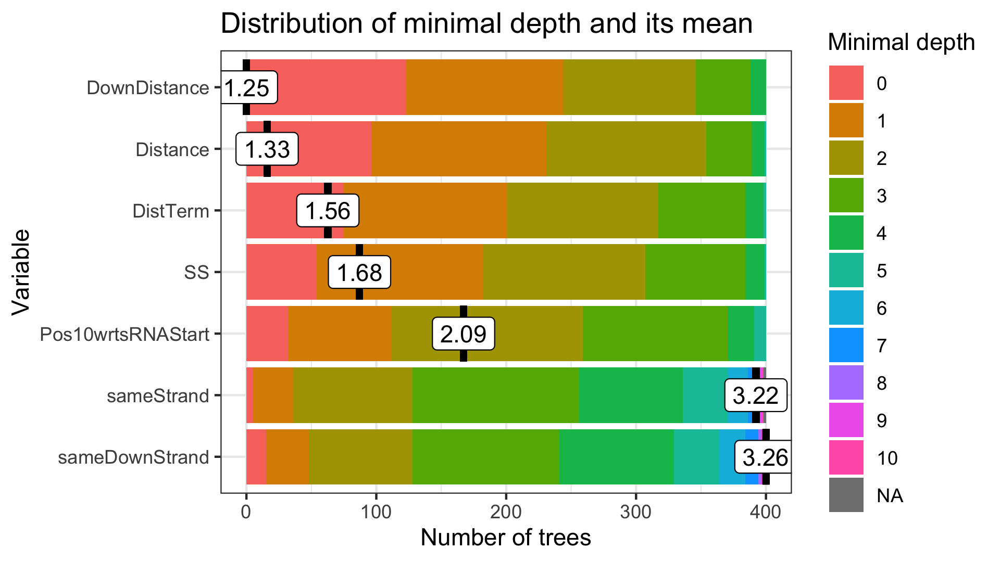

### 14.2 Importance Measures Table 

```{r}
rfe_importance_frame <- read.csv("./Results/RFE_importance_frame_origRF.csv", sep = ",", header = TRUE)
rfe_importance_frame 
```

### 14.3 Multiway Importance Plots
#### 14.3.1 Times a root vs Mean min depth vs Number of Nodes

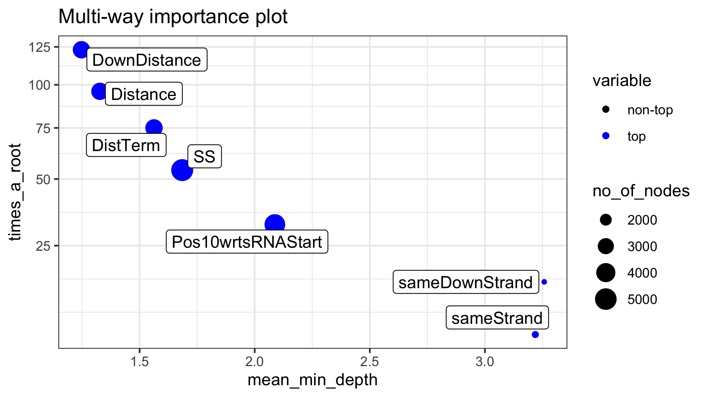

#### 14.3.2 Accuracy Decrease vs. Gini Decrease vs. Times a Root

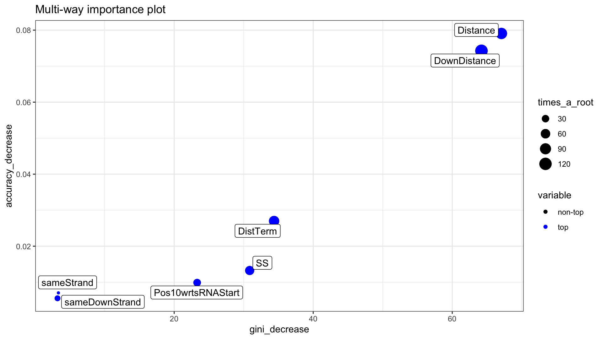

## 15. GGpairs Comparisons

The following graphs are simply helpful in identifying feature importance
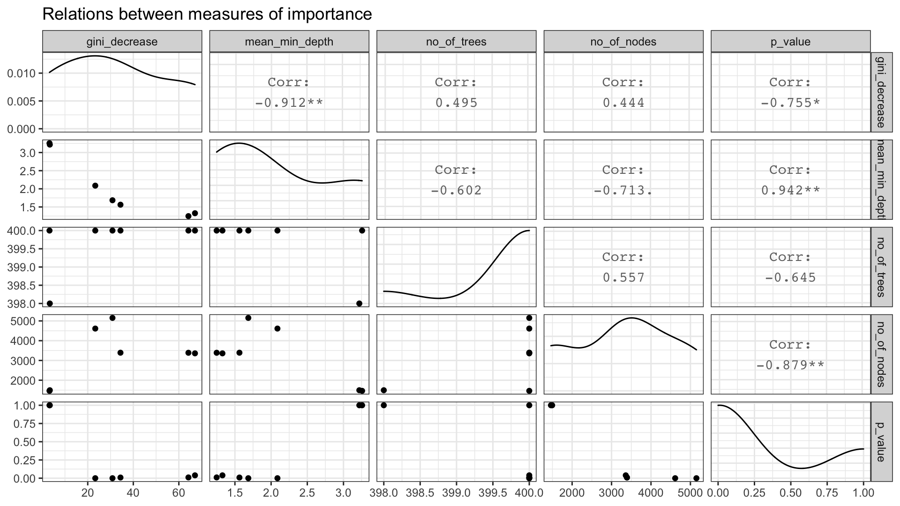

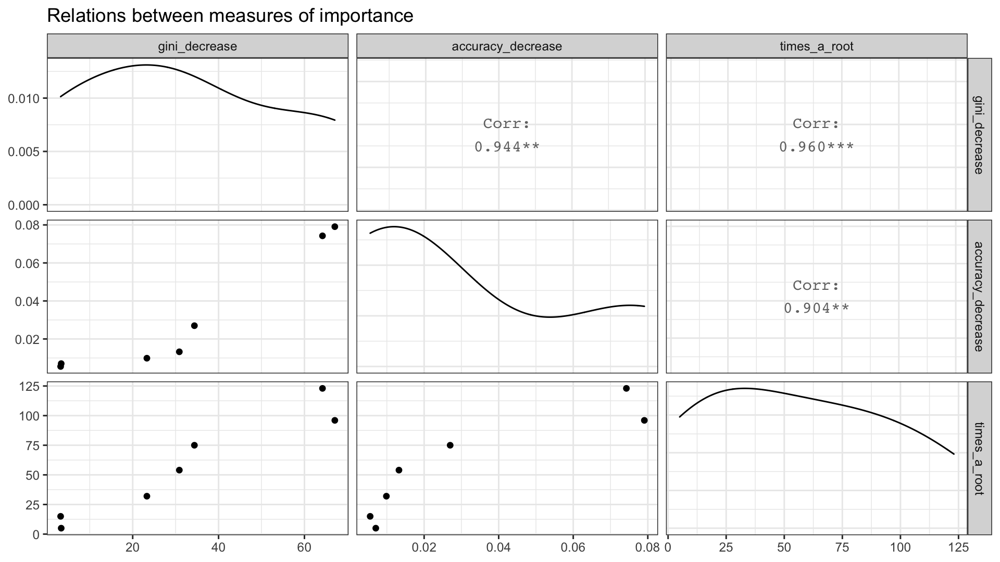

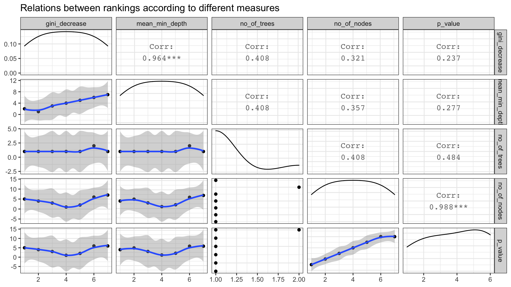

## 16. Feature Interactions

### 16.1 Top 30 Feature Interactions

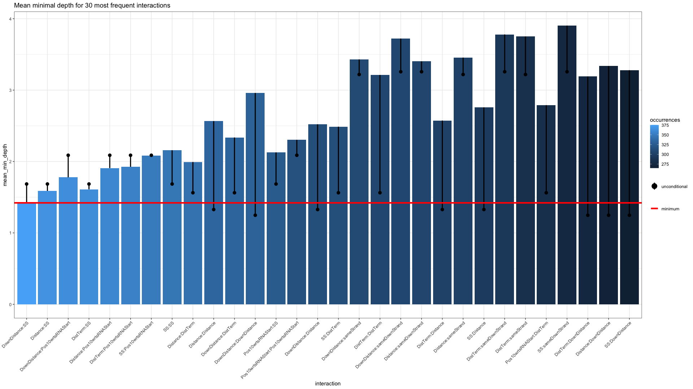 

From this graph, we gather that the top 5 feature interactions are:
  1. DownDistance:SS
  1. Distance:SS
  1. DownDistance:Pos10wrtsRNAStart, 
  1. DistTerm:SS, 
  1. Distance:Pos10wrtsRNAStart
Even though Distance and DownDistance were considered the most important features, their interactions did not appear to be as significant as the others


### 16.2 DownDistance vs. SS

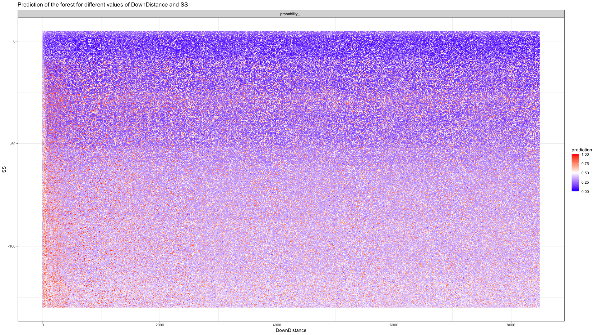
* The higher(closer to 0) the SS, the higher the confidence in the prediction

### 16.3 Distance vs. SS

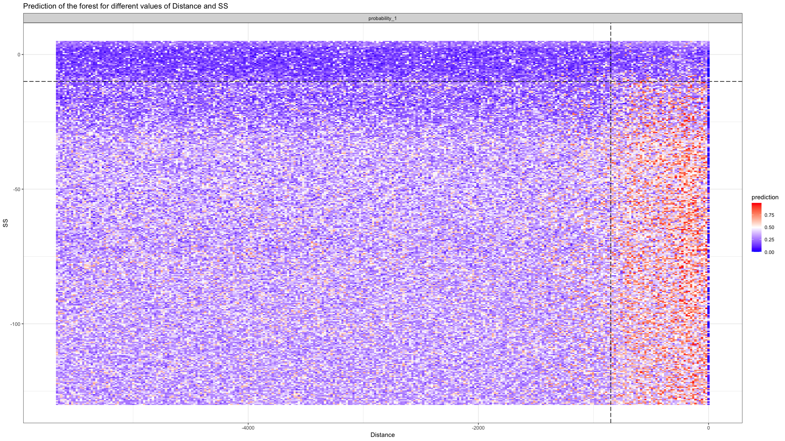
* distances greater than -850 => higher chances of having a bona fide sRNA
* SS higher than -10 => Lower the prob of having a bona fide sRNA

### 16.4 DownDistance vs. Pos10wrtsRNAStart

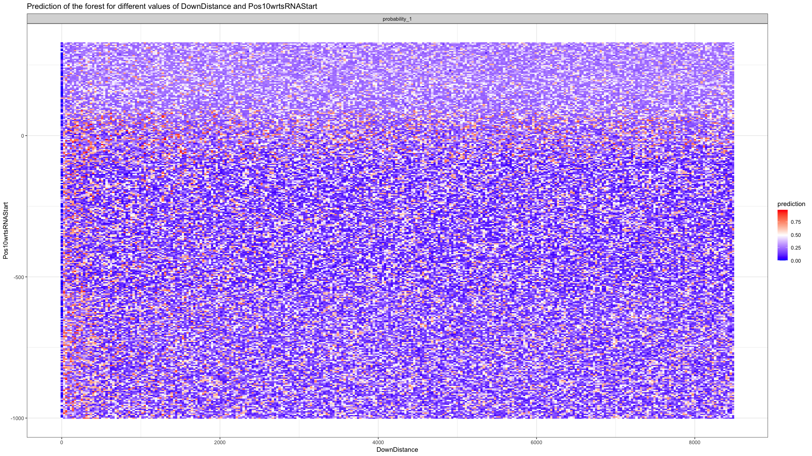 
* No clear disernable takeaway

### 16.5 DistTerm vs. SS

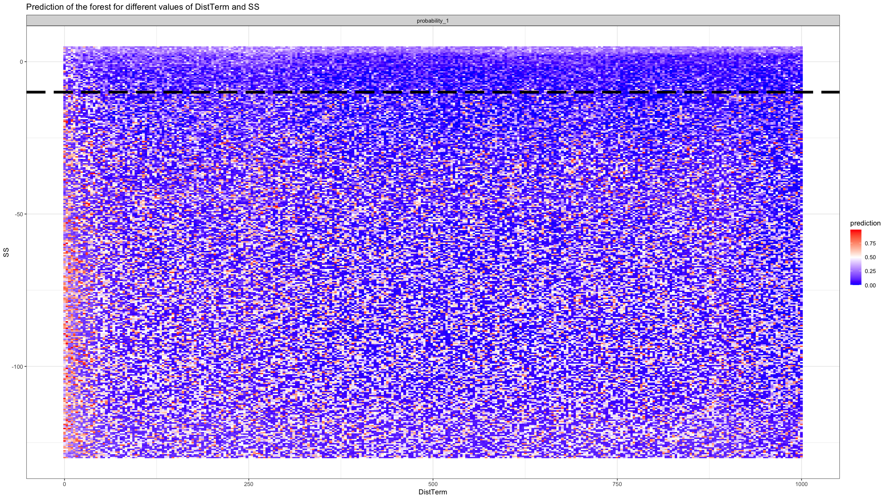
* SS of 0 seems to virtually guarantee that we don't have a bona fide sRNA

### 16.6 Distance vs. Pos10wrtsRNAStart

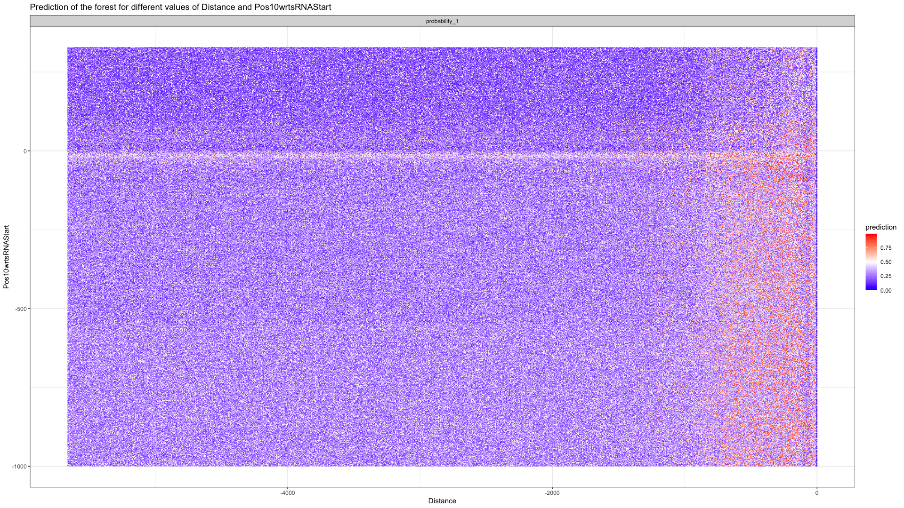 
* Having a Pos10wrtsRNAStart near 0 or slightly lower seems to make predictions fuzzy (near 0.5)


### 16.7 Distance vs. DownDistance

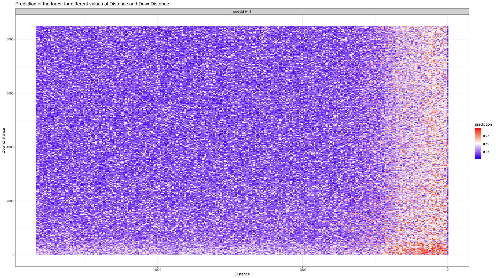 
* These are the 2 top features, but their interactions are not among the top ones
* When both features are close to 0, the chances of having a bona fide sRNA greatly increase
dev.off()

### 16.8 DownDistance vs. DistTerm

Based on the previous plots, generating the following plots seem like a smart thing to do
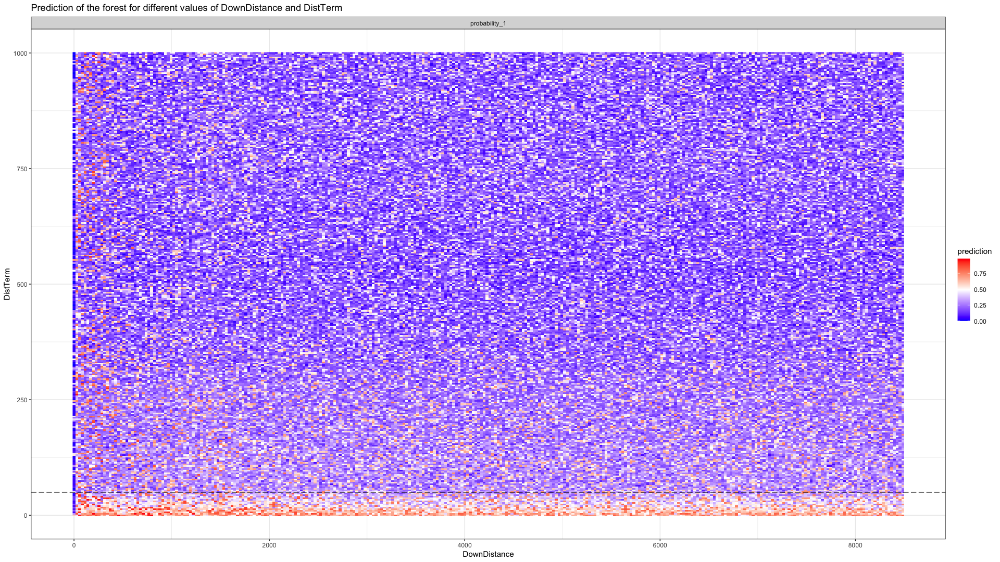
* having a DistTerm less than 50, or close to 0, increases the chances of having a bona fide sRNA

### 16.9 Distance vs. DistTerm

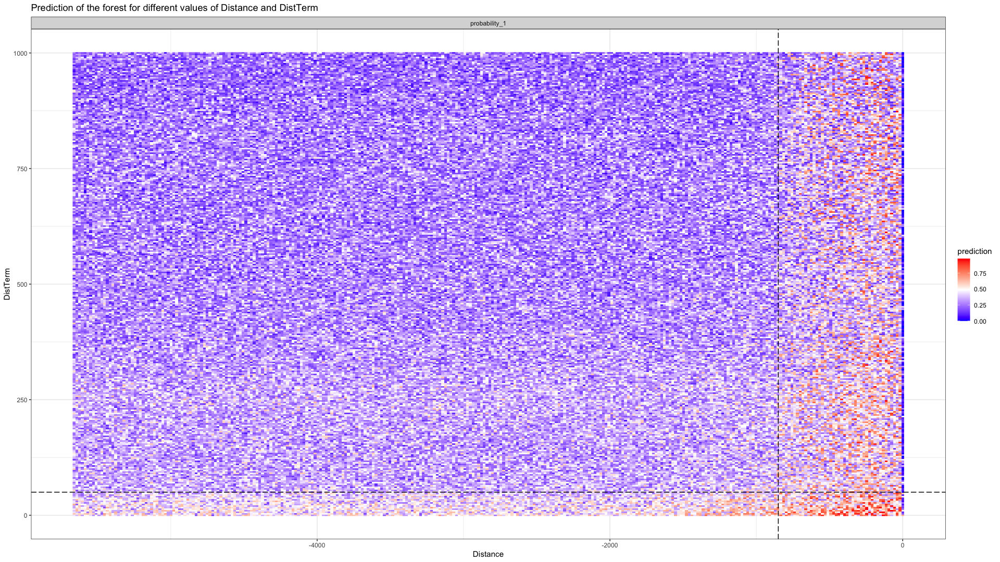

* having a Distance close to 0 increases the chances of having a bona fide sRNA

### 16.10 sameStrand vs sameDownStrand

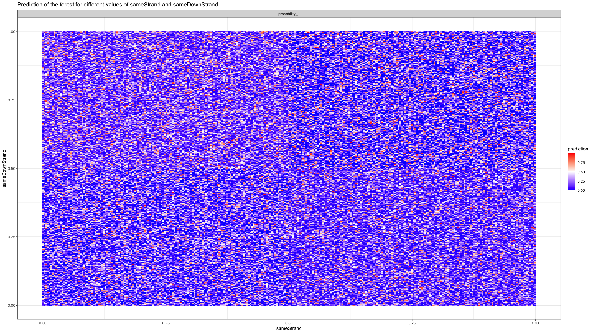

* sameStrand and sameDownStrand were considered the least relevant/important features. However, the overall tone of the graph suggests that having these variables helps boosting the model's confidence in any given prediction. (ie. compare the tones of the previous graph to this one, and it's obvious the model has more "confidence" with its overall decisions in this later graph.)


## 17. RFE Conclusions

There are many conclusions that may be gathered or obtained from the plots above, but the main takeaways can be summarized as follows:
  * The  closer the SS is to 0, the higher the model's confidence in its decision
  * **Having a Distance between -850 and 0 greatly increases the chances of having an sRNA**
  * An SS of -12 or higher will almost guarantee a non bona fide sRNA
  * There is a sweet spot for finding bona fide sRNAs if the DownDistance is less than 500 and the Distance is less than 800
  * **Having a DownDistance less than 60 also greatly increases the chances of having an sRNA**
  * While sameStrand and sameDownStrand were considered the least important features, they seem to contribute in increasing the model's confidence (at least in classifying something as not being an sRNA, as the graph seems to contain mostly solid blue colors)
  
*NOTE/DISCLAIMER:* The numbers here are human approximations based solely on looking at the graphs generated by RFE, and RFE uses only the training data to generate its graphs. 
In other words, while the goal of the RF is to have a general model applicable to any possible bacterial sRNA, there is no guarantee that these conclusions apply to every species of bacteria in the world. 

The RFE library, seems to use many of the pre-existing functions in the randomForest library, combined with ggplot, and some other additional libraries to create better looking and easy to understand graphs. 
Even though the results are not all that different from the ones we got from RFE, we also decided to use the PDP library and save a comparison between the RFE and PDP graphs in [pdp_vs_rfe.pdf](./Results/pdp_vs_rfe.pdf).
We also used the PDP library to generate partial dependance plot individually for each of the 7 features, but the results were not as positive as we had hope in the sense that we didn't get any real insights into sRNAs or our model. 
The graphs for these individual PDP plots can be found in [pdp_individual_features.pdf](./Results/pdp_vs_rfe.pdf). 


# VI) LIME

**LIME FUNCTION ARGUMENTS**

* x	              The training data used for training the model that should be explained.
* model	          The model whose output should be explained
* bin_continuous  Should continuous variables be binned when making the explanation
* n_bins	        The number of bins for continuous variables if bin_continuous = TRUE
* quantile_bins	  Should the bins be based on n_bins quantiles or spread evenly over the range of
                   the training data
* use_density     If bin_continuous = FALSE should continuous data be sampled using a kernel density 
                estimation. If not, continuous features are expected to follow a normal distribution.

**LIME SETTINGS JUSTIFICATIONS**

NOTE: many of these settings were obtained through trial and error, and/or based on the suggestions provided by LIME and its libraries. Since LIME's results are not always the same, we used the settings that  generated the most consistent and valid explanations during our experinments. Of course, we encourage others to try out other settings and experinment further.
* Settings for "explainer"
    *  bin_continuous = TRUE --> Makes explanation easier, and having this setting as true helped in obtaining more consistent and reliable results.
    *  quantile_bins = FALSE --> setting this to TRUE generates an error b/c  sameStrand and sameDownStrand don't have enough variance for the algorithm to use quantile bining.  
    *  use_density = TRUE --> with bin_continuous set to TRUE, this setting becomes irrelevant. In section 3.4, we showed that the features don't follow a normal distribution. We tried setting bin_continuous = FALSE and use_density = TRUE, but this generated contradictory explanations that didn't make sense. 
    *  n_bins = 10 --> The default value wasn't giving us consistent results, so we bumped up the number to 10 and started getting seemingly good results

* Settings for "explain"
    *  n_labels = 1          --> we only have 1 label 
    *  n_features = 7        --> we wanted our explanations to be based on all 7 features 
    *  n_permutations = 2000 --> This number was set through trial and error. Having a small number of permutations does not generate consisten results, so a high number of permutations is recommended. 2000 just seemed to have yielded good results, so we decided to keep this value. If speed is a concern, lowering this number to 1000 should still yield good results. 
    *  dist_fun = "gower"    --> LIME's default dist_fun, and since we have categorical features (sameStrand and sameDownStrand), according to LIME's documentation, "gower" is the functions of choice when dealing with a mixture of numerical and categorical features
    *  Side Note: We tried a couple of runs of the script with euclidean distance, but it didn't seem to have much of an impact. Additionally, the different types of settings, such as different gower powers, kernel widths, and distance functions, that can be tweaked in LIME means that a 100% thorough analysis of every possibility may be nearly impossible. For this reason, we tried to stick to the default settings as offered by LIME. 


## 18. LIME PRE-SETUP
### 18.1 LIME compatability function

The original model was built using the randomForest library found in CRAN. However, even though LIME is supposed to be model agnostic, it's current R implementation only supports certain models out of the box. To extend support of the LIME library to other models, the following functions need to be defined for each  unsupported model type. 

```{r}
model_type.randomForest <- function(x,...) 'classification'

predict_model.randomForest <- function(x, newdata, type, ...) {
  res <- predict(x, newdata = newdata, type = "prob")
  switch(
    type,
    raw = data.frame(Response = ifelse(as.vector(res[,2]) > 0.5, "1", "0"), stringsAsFactors = FALSE),
    prob = as.data.frame(res, check.names = F) 
  )
}
```

### 18.2 Data to Explain

*sampleData, sampleData_scaled,* and *sampleData_norm* all contain the same features, and hence, we should be getting similar explanations in all of our results. We also apply LIME to the same instance 4 times, with the purpose of testing the validity and consistency of LIME's explanations. 

```{r}
sampleData <- slt2data[1,]  # A true sample
sampleData[c(2:4),] <- slt2data[1,]
sampleData[5,] <- slt2data[1986,] # A false sample
sampleData[c(6:8),] <- slt2data[1986,]
sampleData

sampleData_scaled <- slt2data_scaled[1,]  
sampleData_scaled[c(2:4),] <- slt2data_scaled[1,]
sampleData_scaled[5,] <- slt2data_scaled[1986,] 
sampleData_scaled[c(6:8),] <- slt2data_scaled[1986,]
sampleData_scaled

sampleData_norm <- slt2data_norm[1,]  
sampleData_norm[c(2:4),] <- slt2data_norm[1,]
sampleData_norm[5,] <- slt2data_norm[1986,] 
sampleData_norm[c(6:8),] <- slt2data_norm[1986,]
sampleData_norm
```

## 19. LIME with RandomForest Library
### 19.1 In original Model as is

While on occassion all results may look similar, we recommend running this particular section a few times, and you will notice significant changes, like features that may support the explanation in one plot, but contradict it in the next. 
```{r}
predict(origRF, sampleData[c(1,5),-c(8:9)], type = "prob")
lime_explainer_orig <- lime(as.data.frame(trainData[,c(1:7)]), origRF,
                            bin_continuous = TRUE, quantile_bins=FALSE, use_density = TRUE)
lime_explanations_orig <- explain(as.data.frame(sampleData[c(1:4),c(1:7)]), lime_explainer_orig, n_labels = 1, n_features = 7, n_permutations = 2000)
plot_features(lime_explanations_orig)
lime_explanations_orig <- explain(as.data.frame(sampleData[c(5:8),c(1:7)]), lime_explainer_orig, n_labels = 1, n_features = 7, n_permutations = 2000)
plot_features(lime_explanations_orig)

```

### 19.2 In original scaled Model

```{r}
predict(origRF_scaled, sampleData_scaled[c(1,5),-c(8:9)], type = "prob")

lime_explainer_orig_scaled <- lime(as.data.frame(trainData_scaled[, c(1:7)]), origRF_scaled,
                                   bin_continuous = TRUE, quantile_bins=FALSE, 
                                   use_density = FALSE, n_bins = 10)
norm_dist <- as.data.frame(lime_explainer_orig_scaled$bin_cuts)

lime_explainer_orig_scaled <- lime(as.data.frame(trainData_scaled[, c(1:7)]), origRF_scaled,
                                   bin_continuous = TRUE, quantile_bins=FALSE, 
                                   use_density = TRUE, n_bins = 10)
not_norm_dist <- as.data.frame(lime_explainer_orig_scaled$bin_cuts)

# The correlations here show that the bins used by the explainer are the same regardless of what value is given to the use_density parameter.
cor(norm_dist[,"SS"],not_norm_dist[,"SS"])
cor(norm_dist[,"Pos10wrtsRNAStart"],not_norm_dist[,"Pos10wrtsRNAStart"])
cor(norm_dist[,"DistTerm"],not_norm_dist[,"DistTerm"])
cor(norm_dist[,"Distance"],not_norm_dist[,"Distance"])
cor(norm_dist[,"sameStrand"],not_norm_dist[,"sameStrand"])
cor(norm_dist[,"DownDistance"],not_norm_dist[,"DownDistance"])
cor(norm_dist[,"sameDownStrand"],not_norm_dist[,"sameDownStrand"])

lime_explainer_orig_scaled$bin_cuts # All the features seem to be evenly split into 10, ie, a density is not used for the bin splitting.  

lime_explanations_orig_scaled <- explain(as.data.frame(sampleData_scaled[c(1:4),c(1:7)]), 
                                         lime_explainer_orig_scaled, n_labels = 1, 
                                         n_features = 7, n_permutations = 2000
                                         )
plot_features(lime_explanations_orig_scaled)

lime_explanations_orig_scaled <- explain(as.data.frame(sampleData_scaled[c(5:8),c(1:7)]), 
                                         lime_explainer_orig_scaled, n_labels = 1, 
                                         n_features = 7, n_permutations = 2000
                                         )
plot_features(lime_explanations_orig_scaled)

```
  
### 19.3 In original normalized Model

```{r}
predict(origRF_norm, sampleData_norm[c(1,5),-c(8:9)], type = "prob")
lime_explainer_orig_norm <- lime(as.data.frame(trainData_norm[, c(1:7)]), origRF_norm,
                                   bin_continuous = TRUE, quantile_bins=FALSE, 
                                   use_density = TRUE, n_bins = 10)

lime_explainer_orig_norm$bin_cuts # all bins are split evenly, from 0 to 1, in increments of 0.1, as would be expected

lime_explanations_orig_norm <- explain(as.data.frame(sampleData_norm[c(1:4),c(1:7)]), 
                                         lime_explainer_orig_norm, n_labels = 1, 
                                         n_features = 7, n_permutations = 2000
                                         )

plot_features(lime_explanations_orig_norm)

lime_explanations_orig_norm <- explain(as.data.frame(sampleData_norm[c(5:8),c(1:7)]), 
                                         lime_explainer_orig_norm, n_labels = 1, 
                                         n_features = 7, n_permutations = 2000
                                         )
plot_features(lime_explanations_orig_norm)


```

## 20. LIME in Orig RF Conclusions

We tried applying LIME to the Orig RF(in part 15) hoping it would work like a plug-and-play application. 
To our surprise, you can't get LIME to properly work with the "Original" RF model because you must normalize, or scale the data. 
LIME generates random permutations to the features in order to create a linear model, but if the features have different scales and values, it is plausible that features with higher scales will simply outweight the other features, even if they're significantly less important, and hence create skewed models and explanations.
To test this hypothesis, we created a GLM model and reviewed its R^2 value, which was suprisingly low, and hence, finished convincing us that the linear models generated by LIME with the OrigRF were inadequate. 
Additionally, since LIME randomizes the permutation points, based on our experinments, it seems that LIME is using its own randomization algorith (ie. we couldn't set a seed for it), and hence, the exact results we obtained with the OrigRF may not be completely repeatable. However, for the particular case in part 15, that may be irrelevant as the point we are trying to prove there is that LIME's explanations when the data is not scaled or normalized are inconsistent, and hence cannot be trusted.  
For each LIME explanation plot, since we're having LIME explain the same instance, all 4 plots should be identical to each other. 
However, with the OrigRF model, there's usually at least 1 plot that ranks the feature contributions differently, or that may have a feature "Supporting" in one plot, but "Contradicting" in the next. 
Due to LIME's nature, obtaining slightly different results was expected, but not to a degree that would make the explanations invalid.  

By scaling, or normalizing, the data, we were able to obtain more consistent results (ie. features that support or contradict a prediction, behave the same in all the corresponding 4 plots, although their importance ranking may be different), and in most cases, the rankings of feature contributions as plotted by LIME actually remained the same. 
LIME behaves properly if the data is scaled and normalized.

An additional interesting take-away, is that sameStrand and sameDownStrand are considered the least important features, and seem to become completely irrelevant for predictions where the instance is FALSE as LIME simply exclude this feature . 


## 21. LIME for the H2O RF models

Initial struggles with getting LIME set up with the original random forest lead us to believe that since RandomForest wasn't a supported method by default in the Lime Library, that maybe using a supported method would help us overcome these problems. 
During our investigation, we discovered that H2O offered additional IMs (PDPs and SHAP), and that their algorithms were natively supported by the Lime library. 
Thinking we could kill 3 birds (test 3 IMs) with one stone (one package), we proceeded to create the equivalent proxy models in H2O and run the corresponding test. 
The first H2O RF model was created prior to realizing we needed to have normalized and scaled data sets, as these data preprocessing techniques are normally not necessary for random forests. 
Further investigations and testing allowed us to discover that normalizing and scaling the data allowed LIME to generate reasonable explanations with the OrigRF model.
Eventually we decided to create 5 models in total, 2 with the original RandomForest library, and 3 with the H2O library. 
Even though the performance metrics for the scaled and normalized H2O RF models did not match those of the OrigRF, we decided to still include them in the following sections. 

### 21.1 H2O RF Model

```{r}
h2o.predict(object = rfh2o, newdata = as.h2o(sampleData[c(1,8),c(1:7)]) )
lime_explainer_rfh2o <- lime( as.data.frame( trainData[,c(1:7)] ), rfh2o,
                              bin_continuous = TRUE, quantile_bins = FALSE,
                              n_bins = 10
)
lime_explanations_rfh2o <- explain( as.data.frame(sampleData[c(1:4),c(1:7)] ),lime_explainer_rfh2o, 
                                    n_labels = 1,  n_features = 7, 
                                    n_permutations = 2000 )
plot_features(lime_explanations_rfh2o) 

lime_explanations_rfh2o <- explain( as.data.frame(sampleData[c(5:8),c(1:7)] ),lime_explainer_rfh2o, 
                                    n_labels = 1,  n_features = 7, 
                                    n_permutations = 2000 )
plot_features(lime_explanations_rfh2o) 

```

### 21.2 In H2O RF scaled Model

```{r}
h2o.predict(object = rfh2o_scaled, newdata = as.h2o(sampleData_scaled[c(1,8),c(1:7)]))
lime_explainer_rfh2o_scaled <- lime( as.data.frame( trainData_scaled[,c(1:7)] ), rfh2o_scaled,
                              bin_continuous = TRUE, quantile_bins = FALSE) 

lime_explanations_rfh2o_scaled <- explain( as.data.frame(sampleData_scaled[c(1:4),c(1:7)]),  
                                    lime_explainer_rfh2o_scaled, n_labels = 1, 
                                    n_features = 7, n_permutations = 2000, dist_fun = "gower" )
plot_features(lime_explanations_rfh2o_scaled)

lime_explanations_rfh2o_scaled <- explain( as.data.frame(sampleData_scaled[c(5:8),c(1:7)]),  
                                    lime_explainer_rfh2o_scaled, n_labels = 1, 
                                    n_features = 7, n_permutations = 2000, dist_fun = "gower" )
plot_features(lime_explanations_rfh2o_scaled)

```

### 21.3 LIME to H2O RF normalized Model 

```{r}
h2o.predict(object = rfh2o_norm, newdata = as.h2o(sampleData_norm[c(1,8),c(1:7)]) )
lime_explainer_rfh2o_norm <- lime( as.data.frame( trainData_norm[,c(1:7)] ), rfh2o_norm,
                                   bin_continuous = TRUE, quantile_bins = FALSE, use_density = TRUE)

lime_explanations_rfh2o_norm <- explain( as.data.frame(sampleData_norm[c(1:4),c(1:7)] ),
                                         lime_explainer_rfh2o_norm, n_labels = 1, 
                                         n_features = 7, n_permutations = 2000, dist_fun = "gower" )
plot_features(lime_explanations_rfh2o_norm)

lime_explanations_rfh2o_norm <- explain( as.data.frame(sampleData_norm[c(5:8),c(1:7)] ),
                                         lime_explainer_rfh2o_norm, n_labels = 1, 
                                         n_features = 7, n_permutations = 2000, dist_fun = "gower" )
plot_features(lime_explanations_rfh2o_norm)

```

### 21.4 Applying LIME to GLM Model (BONUS) 

```{r}
lime_explainer_glmh2o <- lime( as.data.frame( trainData[,c(1:7)] ),glmh2o, 
                               bin_continuous = TRUE, quantile_bins = FALSE, 
                               use_density = FALSE, n_bins = 10 )
lime_explanations_glmh2o <- explain( as.data.frame(sampleData[c(1:4),c(1:7)] ), lime_explainer_glmh2o,   
                                         n_labels = 1,  n_features = 7, 
                                         n_permutations = 2000, dist_fun = "gower"  )
plot_features(lime_explanations_glmh2o)

lime_explanations_glmh2o <- explain( as.data.frame(sampleData[c(5:8),c(1:7)] ), lime_explainer_glmh2o,   
                                         n_labels = 1,  n_features = 7, 
                                         n_permutations = 2000, dist_fun = "gower"  )
plot_features(lime_explanations_glmh2o)

```


## 25. LIME CONCLUSIONS 

A known problem with LIME is that explanations may be inconsistent from one instance to the next, even when the instances are very similar to each. 
With this in mind, each instance we tested was tested at least 4 times (we manually ran this section over and over again) , and with a high enough number of permutations, we managed to get somewhat consistent results. 
However, some of the results obtained from  LIME were heavily flawed as sometimes it would yield explanations that contradicted the result. 
For some reason, when explaining false instances, LIME would tend to leave out sameStrand and sameDownStrand from the explanation.
Additionally, a GLM was also trained to attempt to measure the variance of the data, but the results from the GLM yielded an R^2 value between 0.2 and 0.3, with a max recall of 0.07.
In other words, the GLM model was only predicting false instances, and since LIME uses linear models for its explanations, based on our observations, it is safe to conclude that LIME was doing the same.
Whenever a TRUE instance was analyze, LIME's explanations would say that most factors contradict the prediction, which is obviously counter intuitive and useless.

During the making of this project, several problems were encountered while trying to apply LIME to the sRNA RF model. 
LIME attempts to explain a complex model's behavior in a small region corresponding to a particular instance of interest by applying a linear model. 
However, in this particular use case, the mixture of categorical and numerical values, plus the differences in ranges within each feature resulted in various experinments without consistent results. 
For this particular use case, LIME was implement in models trained with the original training data, scaled training data, and normalized training data. 
Several attempts were also made at modifying the arguments for the lime() function, such as all the possible permutations between bin_continuous, quantile_bins and use_density. 
In the explain function, the number of permutations was increased from 10 to 2000 and the Euclidean and Gower distance functions were tested with kernel_widths ranging from 0.001 to 5 because we were not getting consistent 

# F) SHAP Values 

```{r}
SHAP_H2O1 <- h2o.predict_contributions(rfh2o, as.h2o(sampleData[,c(1:7)]))
head(SHAP_H2O1,10)
```

# G) PDP 


```{r}
h2o.partialPlot(rfh2o, data = as.h2o(slt2data_h2o), cols = "Distance", plot=TRUE, nbins=2)

partial(origRF, pred.data = trainData[,c(1:7)], x.var = "Distance")

partialPlot(origRF, pred.data = trainData[,c(1:7)], x = "Distance" )

trainData[,c(1:9)]
#h2o.partialPlot(rfh2o, data = as.h2o(trainData), cols = "SS")
#h2o.partialPlot(rfh2o, data = as.h2o(trainData), cols = "Pos10wrtsRNAStart")
#h2o.partialPlot(rfh2o, data = as.h2o(trainData), cols = "DistTerm")
#h2o.partialPlot(rfh2o, data = as.h2o(trainData), cols = "Distance")
#h2o.partialPlot(rfh2o, data = as.h2o(trainData), cols = "DownDistance")
#h2o.partialPlot(rfh2o, data = as.h2o(trainData), cols = "sameStrand")
#h2o.partialPlot(rfh2o, data = as.h2o(trainData), cols = "sameDownStrand")
```

